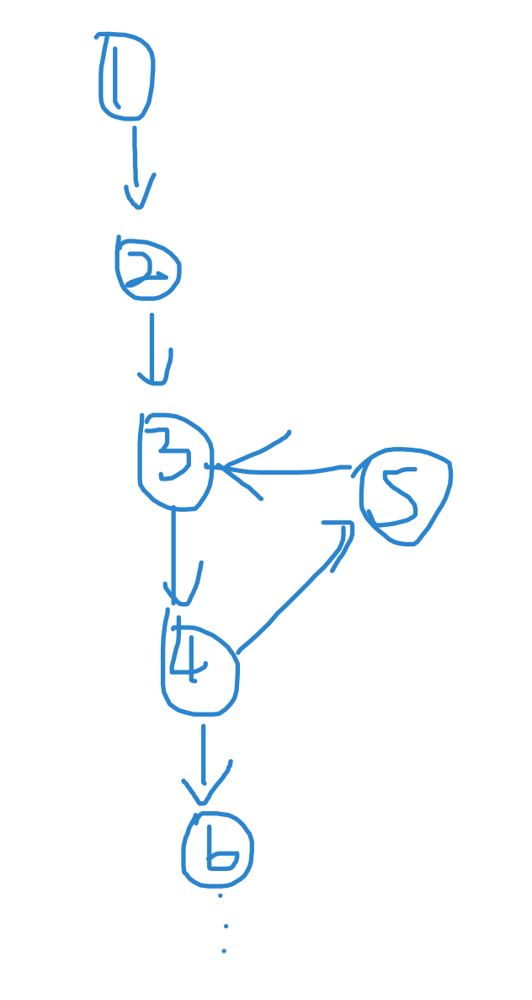
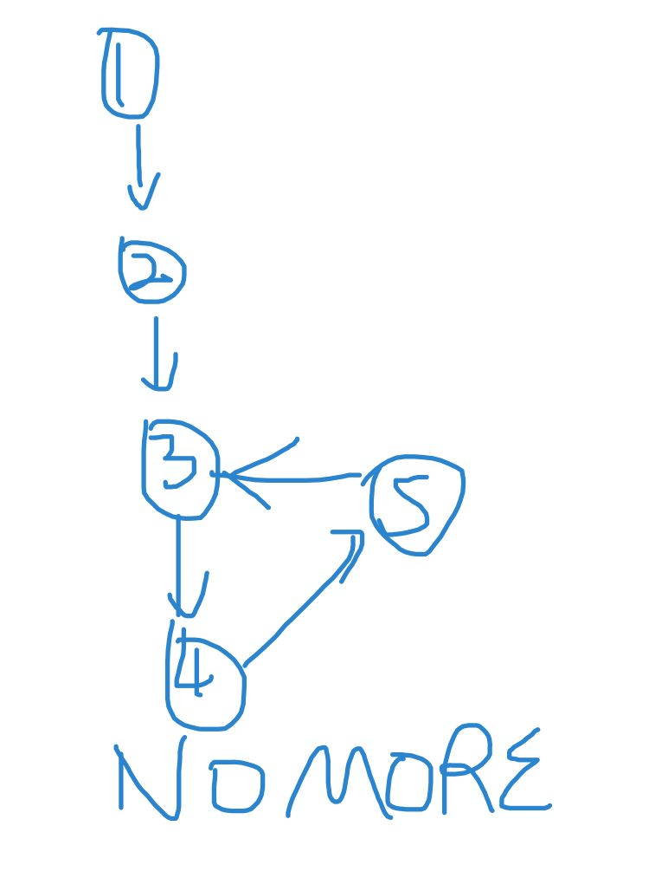

# 141, 142. Linked List Cycle

## 141.

最直接的想法就是，一个点一个点过，没遇到就用哈希表存起来，有遇到就返回。

```text
public class Solution {
    public boolean hasCycle(ListNode head) {
        HashSet<ListNode> map = new HashSet<ListNode>(); // we only care about ListNode, no key-value biz
        while (head != null) {
            if (map.contains(head)) {
                return true;
            } else {
                map.add(head);
                head = head.next;
            }
        }
        return false;
    }
}
```

* Time : O\(n\)
* Space: O\(n\)

官方OS指出了另一种two pointers解法，叫做Floyd's Tortoise and Hare. 

我们注意到这是cyclic linked list, 不是cyclic graph. 在list中每个节点只有一个next pointer. 这也就意味着，如果存在cycle，这个cycle一定在list的末尾。





于是我们可以用双指针，一个fast走两步，一个slow走一步。只要存环，他们一定会相交。

```text
public boolean hasCycle(ListNode head) {
    if (head == null || head.next == null) {
        return false;
    }
    ListNode slow = head;
    ListNode fast = head.next;
    while (slow != fast) {
        if (fast == null || fast.next == null) {
            return false;
        }
        slow = slow.next;
        fast = fast.next.next;
    }
    return true;
}
```

* Time : O\(n\), where n is number of nodes, and n = N + K \(N is number of nodes in acyclic section and K is number of nodes in cyclic section\) 
* Space: O\(1\)

## 142. 

同141基本一样，不同在于要返回cycle开始的节点。

如果我们用hashset, 有代码

```text
public ListNode detectCycle(ListNode head) {
    Set<ListNode> set = new HashSet<ListNode>();
    if (head == null || head.next == null)
        return null;
    boolean succ = false;
    // if the end has been reached (if there are any), OR set has same element, terminate
    while(head != null) {
        succ = set.add(head);
        if (!succ) {
            return head;
        }
        head = head.next;
    }
    return null;
}
```

* Time : O\(n\)
* Space: O\(n\)

如果用双指针，有代码，

```text
public class Solution {
    public ListNode detectCycle(ListNode head) {
        if (head == null) return null;
        
        ListNode slow = head; // tortoise
        ListNode fast = head; // hare
        
        while(fast != null && fast.next != null) {
            slow = slow.next;
            fast = fast.next.next;
            
            if (fast == slow) {
                // Now slow is equal to fast (first encounter)
                // because 2*distanct(slow) = distance(fast)
                ListNode ptr = head;
                while(ptr != slow) {
                    ptr = ptr.next;
                    slow = slow.next;
                }
                return ptr;
            } else {
                // keep going forward
                continue;
            }
        }
        return null;
    }
}
```

当slow和fast第一次相遇时，

2\*dist\(slow\) = dist\(fast\), 

2\*\(线段长度 + 弧1长度\) = 线段长度 + n\*\(弧1长度+弧2长度\) + 弧1长度

线段长度 + 弧1长度 = n\*\(弧1长度 + 弧2长度\) = n \* \(环长\)

两边各加弧2长度，再对环长取余，

线段长度 与 弧2长度 关于 环长 同余。

这意味着，在第二步中，只要ptr走完线段长度，slow就走了多个环 加上一段弧2，并抵达环的开始点。

* Time : O\(n\)
* Space: O\(1\)


