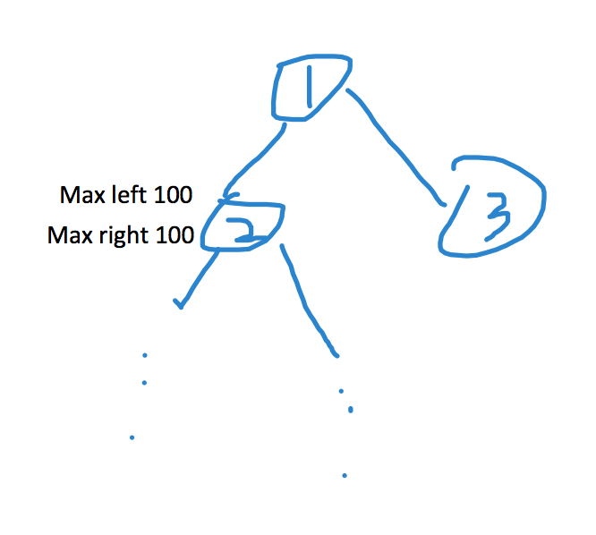

# 543. Diameter of Binary Tree

我这题一开始是懵逼的：如何从一个leaf上上下下走到另一个leaf？直到看了discuss和solution才明白。我们可以记录每个节点的maxLeft, maxRight，这样就得到了途径该点的路径长度maxLeft + maxRight + 1. 我们用递归的方法求所有节点的such路径长度。

注意如下图，虽然经过root的最长路径为101+1+1=103, 但经过2的最长路径为100+100+1=201. 



```java
class Solution {
    int max = 0;
    public int diameterOfBinaryTree(TreeNode root) {
        if (root == null)
            return 0;
        if (root.left == null && root.right == null)
            return 0;
        
        depth(root);
        return max;
    }
    
    int depth(TreeNode root) {
        if (root == null) 
            return 0;
        int ld = depth(root.left);
        int rd = depth(root.right);
        max = Math.max(max, ld + rd);
        return Math.max(ld, rd) + 1; // leaf will have depth return 1
    }
    
    // not used
    boolean isLeaf(TreeNode n) {
        if (n.left == null && n.right == null)
            return true;
        return false;
    }
}

```

* Time : O\(n\) where n is number of nodes
* Space: O\(n\) call stack size

